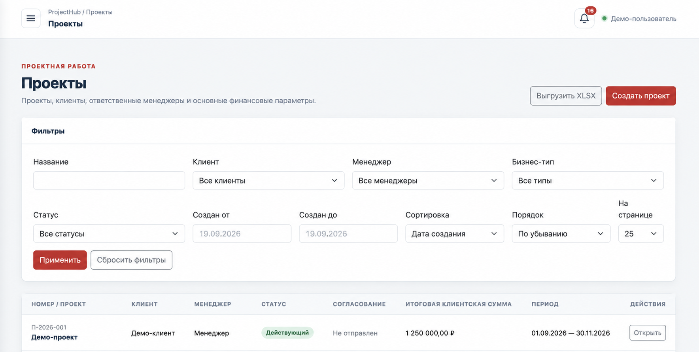
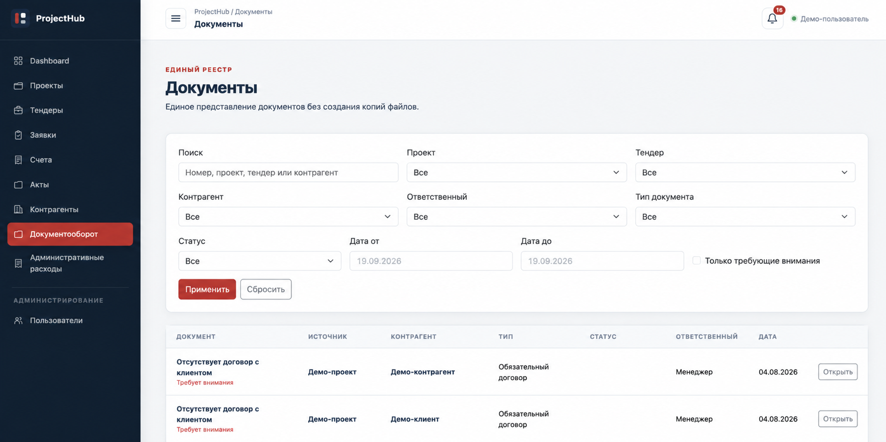

# ProjectHub Demo

Публичная демонстрация одного из ключевых бизнес-процессов проектно-финансовой CRM на Go и PostgreSQL.

> [!IMPORTANT]
> Это самостоятельная clean-room реализация для технического знакомства с проектом. Репозиторий не содержит исходный код production-системы, данные заказчика или его конфиденциальные бизнес-правила. Все названия, суммы и записи в примерах и на скриншотах синтетические.

## О проекте

Основной ProjectHub — закрытая внутренняя CRM, созданная для заказчика и используемая в production. Полная система объединяет проекты, тендеры, рабочие сметы, заявки на оплату, клиентские счета, акты, контрагентов, договоры, уведомления и административные расходы.

В этом репозитории реализован небольшой, но законченный вертикальный срез: создание проектов и конкурентно-безопасное резервирование их бюджета заявками на оплату. Такой объём позволяет показать архитектуру и работу с транзакциями, не раскрывая код закрытой системы.

## Что демонстрирует репозиторий

- разделение приложения на HTTP-, application-, domain- и persistence-слои;
- REST API на стандартном `net/http`;
- PostgreSQL-репозиторий на `pgx`;
- хранение денег целыми копейками без `float`;
- ограничения целостности на уровне схемы базы данных;
- транзакционное резервирование бюджета;
- блокировку строки проекта через `SELECT ... FOR UPDATE`;
- защиту от превышения бюджета при конкурентных запросах;
- строгий разбор JSON и доменные HTTP-ошибки;
- структурированное логирование, healthcheck и корректное завершение сервера;
- unit- и HTTP-тесты, race detector и GitHub Actions;
- воспроизводимый запуск через Docker Compose.

## Интерфейс полной системы

Ниже показаны обезличенные экраны закрытой CRM. Они иллюстрируют интерфейс и предметную область полной системы; сам demo-репозиторий содержит только описанный backend-срез.

### Реестр проектов



### Единый реестр документов



На экране видны фильтры по проектам, тендерам, контрагентам, ответственным, типам и статусам документов.

На изображениях нет реальных ФИО, названий компаний, ИНН, договоров или финансовых показателей заказчика.

## Бизнес-сценарий demo

У проекта есть утверждённый бюджет. Пользователь создаёт заявку на оплату, после чего её сумма сразу резервируется. Несколько одновременных запросов не могут зарезервировать больше доступного остатка: проверка и изменение выполняются внутри одной PostgreSQL-транзакции.

```text
HTTP-запрос
    │
    ▼
Handler → Application service → Repository → PostgreSQL
                                          │
                                          ├─ блокировка проекта
                                          ├─ проверка остатка
                                          ├─ создание заявки
                                          ├─ резервирование суммы
                                          └─ commit
```

Деньги передаются и хранятся в копейках. Например, `2500000` означает `25 000,00 ₽`.

## Технологии

- Go 1.25.13;
- PostgreSQL 17;
- `pgx/v5` и `pgxpool`;
- стандартный `net/http`;
- Docker и Docker Compose;
- GitHub Actions.

## Быстрый запуск

Потребуются Docker и Docker Compose.

```bash
docker compose up --build
```

API будет доступно по адресу <http://localhost:8080>.

Если порт `8080` уже занят:

```bash
HOST_PORT=18082 docker compose up --build
```

Проверка готовности:

```bash
curl http://localhost:8080/healthz
```

## Примеры запросов

Создать проект с бюджетом `150 000,00 ₽`:

```bash
curl -i http://localhost:8080/api/v1/projects \
  -H 'Content-Type: application/json' \
  -d '{
    "name": "Демо-проект",
    "client": "Демо-клиент",
    "budget_kopecks": 15000000
  }'
```

Создать заявку на `25 000,00 ₽`:

```bash
curl -i http://localhost:8080/api/v1/projects/1/payment-requests \
  -H 'Content-Type: application/json' \
  -d '{
    "purpose": "Услуги производства",
    "amount_kopecks": 2500000
  }'
```

Получить список проектов и зарезервированные суммы:

```bash
curl http://localhost:8080/api/v1/projects
```

## API

| Метод | Маршрут | Назначение |
|---|---|---|
| `GET` | `/healthz` | проверка доступности PostgreSQL |
| `GET` | `/api/v1/projects` | список проектов |
| `POST` | `/api/v1/projects` | создание проекта |
| `POST` | `/api/v1/projects/{id}/payment-requests` | резервирование бюджета и создание заявки |

## Конкурентная безопасность

Создание заявки выполняется в одной транзакции:

1. Строка проекта блокируется `SELECT ... FOR UPDATE`.
2. Рассчитывается доступный остаток `budget_kopecks - reserved_kopecks`.
3. При нехватке средств возвращается доменная ошибка `project budget exceeded`.
4. Создаётся заявка на оплату.
5. Зарезервированная сумма проекта увеличивается.
6. Транзакция фиксируется.

В Docker-проверке два одновременных запроса по `7 000` копеек к бюджету `10 000` дали ожидаемый результат: один запрос получил HTTP `201`, второй — HTTP `409`. Итоговый резерв составил `7 000` копеек, переполнение не произошло.

## Тестирование и качество

```bash
go test -race ./...
go vet ./...
staticcheck ./...
golangci-lint run ./...
govulncheck ./...
```

Локально и в GitHub Actions проходят unit- и HTTP-тесты, `go vet` и race detector. `govulncheck` не находит известных уязвимостей в используемой конфигурации.

## Структура репозитория

```text
cmd/api/                    точка запуска HTTP-приложения
internal/app/               сценарии использования и валидация
internal/domain/            доменные модели и ошибки
internal/httpapi/           HTTP-транспорт
internal/store/postgres/    PostgreSQL-репозиторий и миграция
assets/screenshots/         обезличенные изображения интерфейса
.github/workflows/          непрерывная интеграция
```

Основное направление зависимостей:

```text
HTTP handler → application service → repository → PostgreSQL
```

## Границы demo

Репозиторий намеренно не воспроизводит всю закрытую CRM. В него не включены авторизация, SSR-интерфейс, тендеры, полная смета, клиентские счета, акты, договоры, файлы, уведомления и процессы согласования. Эти модули перечислены только как контекст production-системы и не заявляются как функциональность данного demo.

## Лицензия

MIT. Репозиторий не содержит клиентский код, персональные данные или конфиденциальные материалы.
